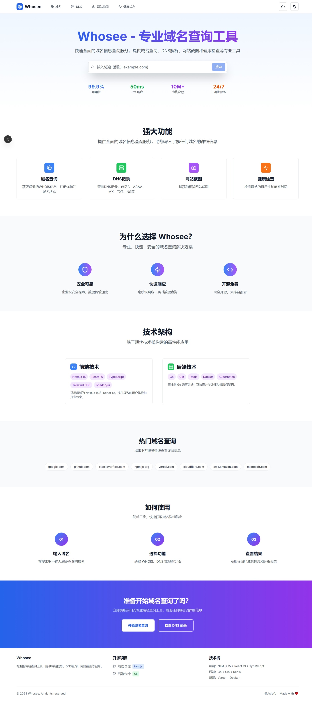

# Whosee.me - 专业域名查询工具

<div align="center">


</div>

一个现代化的域名信息查询平台，提供 WHOIS 信息查询、DNS 记录查询、网站截图等功能，集成 Strapi 5 CMS 支持多语言博客内容管理。

## 项目仓库
- **后端项目**: [whosee-server](https://github.com/AsisYu/whosee-server) - Go 高性能后端服务
- **内容管理**: [Strapi 5](https://github.com/strapi/strapi) - 多语言博客内容管理系统
- **在线演示**: [whosee.me](https://whosee.me) - 在线体验完整功能

## 项目预览

<div align="center">
  
  <p><em> Whosee 首页 - 简洁现代的域名查询界面</em></p>
</div>

**核心功能亮点**

- **主题切换**：支持明暗主题无缝切换、自动跟随系统设置、持久化存储及自定义配色。
- **国际化**：中英文界面动态切换，SEO友好，移动端适配良好。
- **响应式设计**：采用移动端优先策略，兼容手机、平板与桌面端，触摸体验优化。
- **性能优化**：支持代码分割、图片压缩、SSR渲染与多层缓存，加载极速。
- **现代界面**：简洁直观，安全可靠（JWT认证），服务状态实时监控。

---

**核心功能模块**

- **域名查询**：提供完整 WHOIS/RDAP 信息、注册商与联系人数据、NS 记录、域名状态及一键复制功能。
- **DNS 查询**：支持 A、AAAA、MX、TXT、CNAME 等多种记录类型，多服务器对比、响应时间显示与可视化展示。
- **网站截图**：支持桌面、平板、手机三端高清截图，实时生成、多格式下载，附带元数据信息。
- **系统监控**：实时展示服务状态、CPU/内存/磁盘使用率、响应时间，支持历史趋势图表与异常告警。
- **内容管理（CMS）**：基于 Strapi 5 的博客系统，支持中英文内容、富文本编辑、分类标签、SEO 优化与 RSS 订阅。
- **用户体验优化**：集成智能搜索补全、查询历史记录、极速加载与直观操作界面。

## 技术栈

### 前端框架
- **Next.js 15** - 最新 React 框架，支持 SSR 和 SSG
  
  
  
- **React 19** - 最新的 React 版本，性能升级
  
  
  
- **TypeScript** - 类型安全的 JavaScript，代码更可靠
  
  
  
- **App Router** - Next.js 13+ 新路由系统

### 样式和 UI 
- **TailwindCSS 3.4** - 实用优先的 CSS 框架
  
  
  
- **Lucide React** - 1000+ 现代化矢量图标库
  
  
  
- **Framer Motion** - 高性能动画和交互库
  
  
  
- **CVA** - class-variance-authority 组件变体管理
- **clsx & tailwind-merge** - 智能样式类名合并工具

### 内容管理系统
- **Strapi 5** - 现代化无头 CMS，强大的内容管理
  
  
  
- **博客系统** - 完整的多语言博客解决方案
- **媒体管理** - 统一的图片和文件管理系统
- **API 集成** - REST API 和 GraphQL 双重支持
- **权限控制** - 细粒度的角色和权限管理

### 国际化和主题 
- **next-intl** - 完整的国际化解决方案
- **next-themes** - 主题切换和持久化存储
- **双语支持** - 中文/英文完整翻译
- **SSR 友好** - 服务端渲染国际化支持

### 开发工具
- **ESLint** - 代码质量检查和规范
  
  
  
- **PostCSS** - CSS 后处理器和优化
  
  
  
- **Turbopack** - 超快构建工具 (开发模式)
  
  
  
- **npm** - 依赖包管理和脚本执行
  
  

## 快速开始

### 环境要求
- **Node.js** 18.17 或更高版本
- **包管理器** npm 或 yarn
- **操作系统** Windows、macOS、Linux 均支持

### 环境变量配置（重要）

⚠️ **首次运行请先配置环境变量**

1. **查看配置文档**：
   - [环境变量配置指南](./docs/ENVIRONMENT_CONFIG.md) - 详细配置说明
   - [配置示例](./docs/ENV_EXAMPLE.md) - 完整配置模板

2. **创建环境配置文件**：
   ```bash
   # 在项目根目录创建 .env.local 文件
   touch .env.local
   ```

3. **基本配置**（最少需要这些）：
   ```env
   # Strapi CMS 配置
   NEXT_PUBLIC_STRAPI_URL=http://localhost:1337
   NEXT_PUBLIC_STRAPI_API_TOKEN=your_strapi_api_token_here
   ```

4. **配置验证**：
   启动开发服务器后，访问 `http://localhost:3000/debug` 检查配置状态

### 安装依赖
```bash
#  安装项目依赖
npm install

# 或使用 yarn
yarn install
```

### 开发环境
```bash
# 启动开发服务器
npm run dev

#  启动安全模式（带 API 密钥）
npm run dev:secure
```

应用将在 **[http://localhost:3000](http://localhost:3000)** 启动。

### 构建生产版本 
```bash
# 构建生产版本
npm run build

#  分析构建包大小
npm run build -- --analyze
```

### 启动生产服务器
```bash
# 启动生产服务器
npm start
```

### 代码质量检查
```bash
# ESLint 代码检查
npm run lint

# 自动修复代码问题
npm run lint -- --fix
```

## 项目结构

```
📁 whosee-whois/
├── 📂 cms/                       # Strapi 5 CMS 系统
│   ├── 📂 config/               # ⚙️ CMS 配置文件
│   ├── 📂 src/                  # 📂 CMS 源代码
│   │   ├── 📂 api/              # 🔌 内容类型和 API
│   │   │   ├── 📂 blog-post/   # 博客文章
│   │   │   ├── 📂 category/    # 分类管理
│   │   │   └── 📂 tag/         # 🔖 标签管理
│   │   ├── 📂 components/       # 🧩 CMS 组件
│   │   └── 📂 extensions/       # CMS 扩展
│   ├── package.json         #  CMS 依赖
│   └── README.md            # 📖 CMS 说明
├── 📂 src/
│   ├── 📂 app/                    # 🅰️ Next.js App Router 页面
│   │   ├── 📂 [locale]/          #  国际化路由
│   │   │   └── 📂 blog/         # 博客页面
│   │   │       ├── 📂 [slug]/   # 博客文章详情
│   │   │       └── page.tsx  # 博客列表
│   │   ├── 📂 domain/            # 域名查询页面
│   │   ├── 📂 dns/               # DNS 查询页面
│   │   ├── 📂 screenshot/        # 截图页面
│   │   ├── 📂 health/            #  健康监控页面
│   │   ├── 📂 debug/             # 调试页面
│   │   ├── layout.tsx         #  根布局
│   │   └── page.tsx           # 🏠 首页
│   ├── 📂 components/            # ⚛️ React 组件
│   │   ├── 📂 ui/                #  通用 UI 组件
│   │   ├── 📂 blog/              # 博客相关组件
│   │   ├── 📂 seo/               # SEO 组件
│   │   ├── 📂 providers/         # 上下文提供者
│   │   └── 📂 examples/          # 示例组件
│   ├── 📂 lib/                   # 工具库
│   │   ├── api.ts             # 🔌 API 调用服务（含 CMS）
│   │   ├── secure-api.ts      #  安全 API 服务
│   │   └── utils.ts           # 🧰 通用工具函数
│   ├── 📂 messages/              #  国际化翻译文件
│   │   ├── en.json            # 🇺🇸 英文翻译
│   │   └── zh.json            # 🇨🇳 中文翻译
│   ├── 📂 types/                 # TypeScript 类型定义
│   └── 📂 i18n/                  # 国际化配置
├── 📂 public/                    # 📁 静态资源
├── 📂 docs/                      # 项目文档
│   ├── 📂 Strapi 5 CMS/         # CMS 文档
│   └── 📂 images/                # 文档图片
├── tailwind.config.ts         #  TailwindCSS 配置
├── next.config.ts             # ⚙️ Next.js 配置
├── tsconfig.json              # TypeScript 配置
├── package.json               #  项目依赖
├── .env.local                 # 🔐 环境变量（需创建）
├── .env.example               # 环境变量示例
└── README.md                  # 📖 项目说明
```

### Next.js 配置
项目的 **[next.config.ts](next.config.ts)** 已配置以下功能：

#### 国际化支持 
- **自动集成** `next-intl` 插件
- **语言切换** 支持中文（默认）和英文切换
- **开发环境代理** 开发模式下自动代理后端 API 请求，解决 CORS 问题：
  - `/api/*` → `http://localhost:3000/api/*`
  - `/static/*` → `http://localhost:3000/static/*`
- **图片优化** 支持从以下域名加载远程图片：
  - **开发环境**: `http://localhost:3000`
  - **生产环境**: `https://api.whosee.me`
- **安全配置** 自动添加安全头部：
  - `X-Frame-Options: DENY` - 防止页面被嵌入
  - `X-Content-Type-Options: nosniff` - 防止 MIME 类型嗅探
  - `Referrer-Policy: origin-when-cross-origin` - 控制引用信息

### API 集成
项目已完成与后端服务的全面对接 (`src/lib/api.ts`)，支持：

#### JWT 认证系统
- 自动获取和管理JWT令牌
- 30秒令牌有效期，每个令牌限用一次
- 认证失败自动重试机制

#### 完整功能支持
- **WHOIS查询**: 传统域名注册信息查询
- **RDAP查询**: 现代化WHOIS替代方案（推荐）  
- **DNS记录查询**: 支持A、AAAA、MX、TXT、NS、CNAME、SOA、PTR记录
- **网站截图**: 支持普通截图和Base64编码截图
- **ITDog测速**: 网站性能测试和多地ping检测
- **健康监控**: 全面的后端服务状态监控
- **博客系统**: 基于 Strapi 5 的完整博客和内容管理
- **内容管理**: 多语言文章、分类、标签管理

#### 使用示例
```typescript
import { queryRDAPInfo, queryDNSInfo, getBlogPosts, ApiError } from '@/lib/api';

// RDAP查询（推荐）
try {
  const result = await queryRDAPInfo('example.com');
  console.log('域名信息:', result);
} catch (error) {
  if (error instanceof ApiError) {
    console.error('查询失败:', error.message);
  }
}

// 博客内容查询
try {
  const posts = await getBlogPosts({
    locale: 'zh',
    pagination: { page: 1, pageSize: 10 }
  });
  console.log('博客文章:', posts);
} catch (error) {
  console.error('获取博客失败:', error);
}
```

#### 环境配置
配置后端 API 和 Strapi CMS 地址：
```env
# 后端 API 配置
NEXT_PUBLIC_API_URL=http://localhost:8080

# Strapi CMS 配置（必需）
NEXT_PUBLIC_STRAPI_URL=http://localhost:1337
NEXT_PUBLIC_STRAPI_API_TOKEN=your_strapi_api_token
```

详细配置请参考：
- [环境变量配置指南](./docs/ENVIRONMENT_CONFIG.md)
- [Strapi 5 集成指南](./docs/Strapi%205%20CMS/STRAPI5_GUIDE.md)

## AI 开发工具

本项目采用 AI 辅助开发，使用 Trae 和 Cursor 等现代化 AI 工具进行代码生成、架构设计和开发优化，显著提升开发效率和代码质量。

## 贡献指南

<div align="center">


</div>

1. **Fork 项目** - 将项目 Fork 到你的 GitHub 账户
2. **创建功能分支** (`git checkout -b feature/AmazingFeature`)
3. **提交更改** (`git commit -m 'Add some AmazingFeature'`)
4. **推送到分支** (`git push origin feature/AmazingFeature`)
5. **打开 Pull Request** - 创建 PR 并详细描述你的改动

### 贡献类型 
- **Bug 修复** - 修复现有问题
- **新功能** - 添加新的功能特性
- **文档改进** - 完善项目文档
- **UI/UX 优化** - 改进用户界面和体验
- **性能优化** - 提升应用性能

## 许可证

本项目采用 MIT 许可证 - 查看 [LICENSE](LICENSE) 文件了解详情。

## 联系我们

<div align="center">

### 项目仓库 

[](https://github.com/AsisYu/whosee-whois)
[](https://github.com/AsisYu/whosee-server)

### 反馈与支持

[](https://github.com/AsisYu/whosee-whois/issues)
[](https://github.com/AsisYu/whosee-whois/discussions)
[](mailto:contact@whosee.me)

### 关注我们

[](https://github.com/AsisYu)
[](https://whosee.me)

</div>

---

<div align="center">

**Made with by [AsisYu](https://github.com/AsisYu)**


</div>
