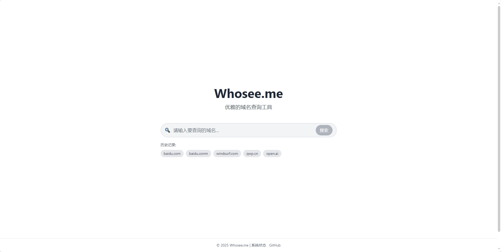

# Whosee.me - 优雅的域名查询工具

<div align="center">
  
  
  
  [](https://svelte.dev/)
  [](https://www.typescriptlang.org/)
  [](https://tailwindcss.com/)
  [](https://opensource.org/licenses/MIT)
  
</div>

Whosee.me是一个简单、优雅的域名查询工具，帮助您快速了解域名的WHOIS信息、DNS记录等详细数据。

## ✨ 项目特点

- 🔍 快速查询任意域名的WHOIS信息
- 🌐 查询域名的DNS记录
- 🖼️ 支持多种截图功能
  - 📸 普通网站截图
  - 📊 ITDog测速截图
  - 🛠️ 增强的错误处理，当网站无法访问时提供友好提示
  - 🔄 自动在域名变更时清除上一次的截图结果
- 🚀 高效的缓存机制，加速查询过程
- 🎨 现代化UI设计，优雅的用户体验
- 📱 完全响应式，支持各种设备
- 🔄 自动保存搜索历史
- ⚡ 基于Svelte构建，性能卓越

## 🛠️ 技术栈

<table>
  <tr>
    <th>前端</th>
    <th>后端</th>
  </tr>
  <tr>
    <td>
      <ul>
        <li>🔧 <b>框架</b>：Svelte + SvelteKit</li>
        <li>🎭 <b>UI组件</b>：Skeleton UI</li>
        <li>🎨 <b>样式处理</b>：TailwindCSS</li>
        <li>🏗️ <b>构建工具</b>：Vite</li>
        <li>📝 <b>开发语言</b>：TypeScript</li>
        <li>📸 <b>截图工具</b>：Puppeteer</li>
      </ul>
    </td>
    <td>
      <ul>
        <li>🚀 <b>框架</b>：Gin (Go)</li>
        <li>⚡ <b>缓存</b>：Redis</li>
        <li>🔐 <b>认证</b>：JWT</li>
        <li>🔌 <b>API集成</b>：WHOIS API, DNS查询</li>
      </ul>
    </td>
  </tr>
</table>

## 📂 项目架构

这是前端仓库，后端代码位于单独的仓库 [whosee-server](https://github.com/AsisYu/whosee-server)。

```
src/                      # 前端源代码
├── lib/                  # 共享库文件
│   ├── api/              # API接口
│   │   ├── auth.ts       # 认证相关
│   │   ├── dns.ts        # DNS查询
│   │   ├── health.ts     # 健康检查
│   │   ├── screenshot.ts # 截图功能
│   │   └── whois.ts      # WHOIS查询
│   ├── components/       # 可复用组件
│   │   ├── common/       # 通用组件
│   │   ├── domain/       # 域名相关组件
│   │   └── screenshot/   # 截图相关组件
│   ├── stores/           # 状态管理
│   └── config/           # 配置管理
└── routes/               # 页面路由
    ├── api/              # API路由
    │   ├── screenshot/   # 截图API
    │   └── whois/        # WHOIS API
    └── health/           # 健康检查页面
```

## 🔌 API接口

前端通过API接口与后端通信，后端实现位于 [whosee-server](https://github.com/AsisYu/whosee-server) 仓库。


## 📥 安装指南

### 环境要求

- Node.js 18.0.0 或更高版本
- npm 9.0.0 或更高版本

### 安装依赖

```bash
# 安装依赖
npm install
```

### 环境配置

创建环境配置文件 `.env`：

```
# API配置
VITE_API_PROTOCOL=http  # API服务器协议
VITE_API_HOST=localhost  # API服务器主机名
VITE_API_PORT=3900  # API服务器端口号

# 认证配置
VITE_API_TOKEN=xxx  # API认证令牌

# 缓存配置
VITE_CACHE_ENABLED=true  # 是否启用缓存
VITE_CACHE_TTL=1800000  # 缓存有效期(毫秒)，默认30分钟

# 其他配置
VITE_DEBUG_MODE=false  # 是否启用调试模式
```

### 开发服务器

启动开发服务器：

```bash
npm run dev
```

在浏览器中打开：

```bash
npm run dev -- --open
```

### 构建项目

创建生产版本：

```bash
npm run build
```

预览生产构建：

```bash
npm run preview
```

## 🔗 后端设置

后端代码位于单独的仓库 [whosee-server](https://github.com/AsisYu/whosee-server)，请参考该仓库的README文件获取安装和配置指南。

## 🖼️ 项目截图



## 🤝 贡献指南

欢迎提交问题和功能请求！如果您想贡献代码，请先创建一个issue讨论您的想法。

## 📄 许可证

[MIT](LICENSE)
